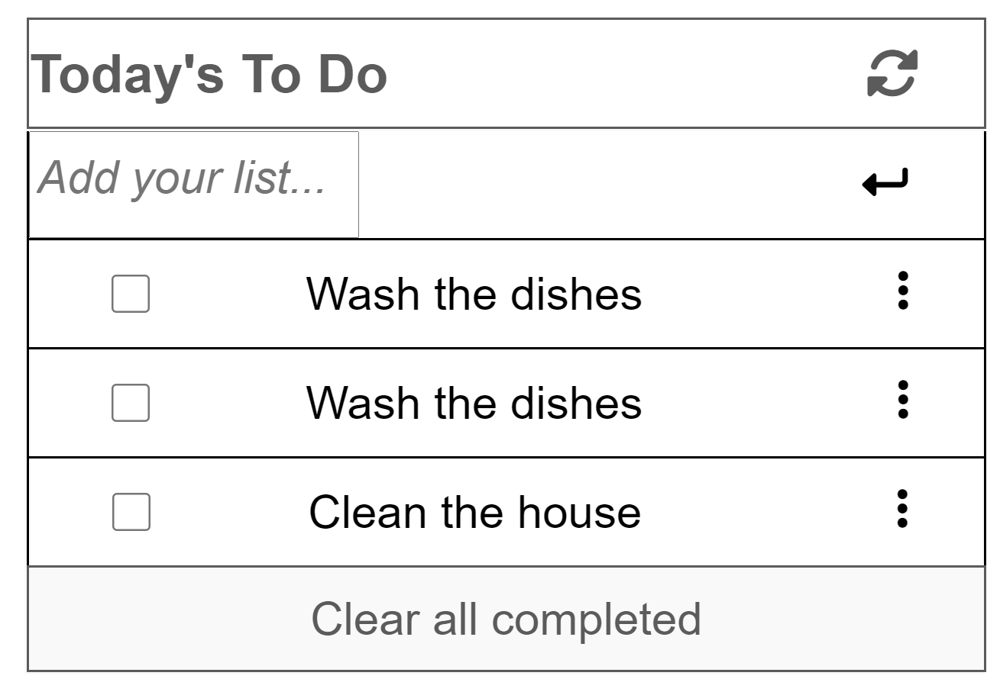

To-Do list structure

This is the first Microverse Project for the second week. It involves creating a simple none responsive list structure , HTML and CSS. The project has been set up using webpack.

## Built With

HTML
CSS
javascript
Webpack as technology

## Live Demo

[Live Demo Link](https://delhinrharl.github.io/ToDoList/dist)

## Getting Started

To get a local copy up and running follow these simple example steps.

### Prerequisites

HTML,CSS,Git basics, Webpack

### Setup

### Install

Visual Studio Code Editor
Web Browser
[Make a clone of the Repository using] git@github.com:DelhinRharl/Portfolio.git

Install the necessary dependencies and run npm start on the terminal

### Run tests

create a workflow folder in the repository folder
and run .github/workflows/linters.yml
#Tests Passed :Lighthouse, webhint, Stylelint and ESLint Test

## Authors

👤 **Author1**

- GitHub: [@DelhinRharl](https://github.com/DelhinRharl)
- Twitter: [@tdelhinrharl](https://twitter.com/delhinrharl)
- LinkedIn: [LinkedIn](https://linkedin.com/in/AffaxedKiprotich)

## 📝 License

This project is [MIT](./MIT.md) licensed.
